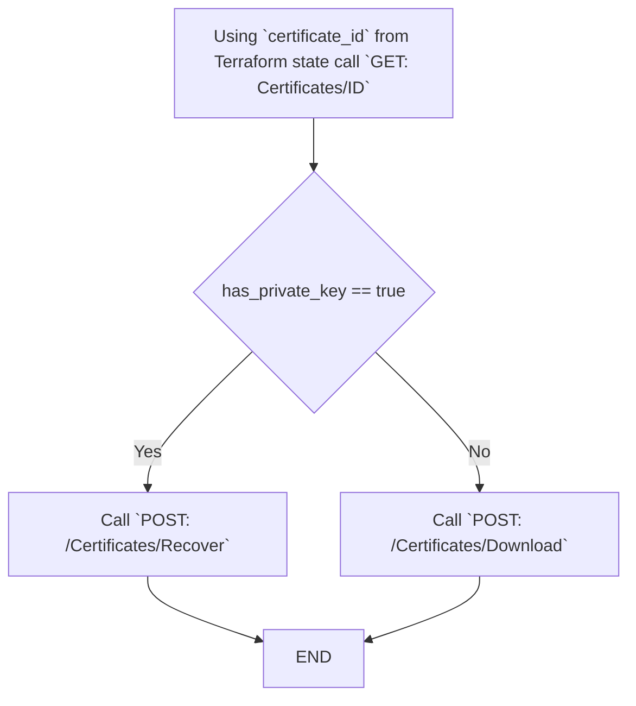
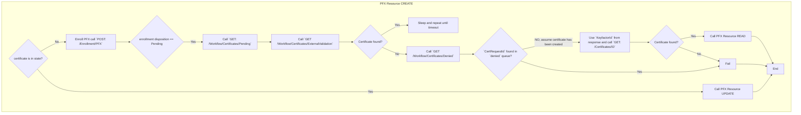
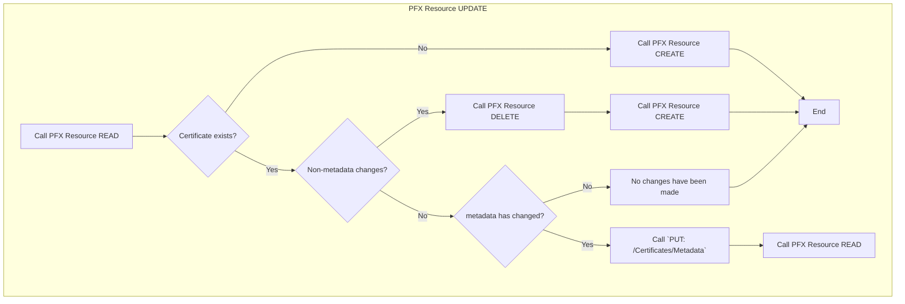
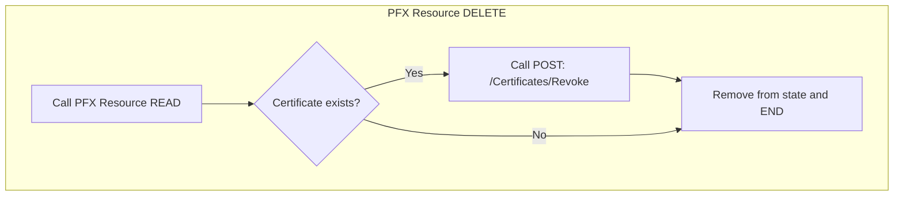

# keyfactor_certificate resource API Calls:

Below summarizes the API calls made by the `keyfactor_certificate` resource for each of the `Terraform` operations.

Supported Operations:

- [READ](#PFX-Resource-READ)
- [CREATE](#PFX-Resource-CREATE)
- [UPDATE](#PFX-Resource-UPDATE)
- [DELETE](#PFX-Resource-DELETE)

## Table of Contents

- [keyfactor\_certificate resource API Calls](#keyfactor_certificate-resource-api-calls)
    - [Supported Operations](#supported-operations)
    - [PFX Resource READ](#pfx-resource-read)
        - [Required Permissions](#required-permissions)
    - [PFX Resource CREATE](#pfx-resource-create)
        - [Required Permissions](#required-permissions-1)
    - [PFX Resource UPDATE](#pfx-resource-update)
        - [Required Permissions](#required-permissions-2)
    - [PFX Resource DELETE](#pfx-resource-delete)
        - [Required Permissions](#required-permissions-3)
    - [Permissions](#permissions)

## PFX Resource READ:

1. Call `GET: certificate/{Id}` to get the certificate ID, can be scoped using `collection_id` from plan. This requires
   `certificate:read` permissions, and can be scoped using `collection_id` from plan. This provides certificate
   `metadata` and `has_private_key` information.
2. If `has_private_key` is `true` call `POST /Certificates/Recover` to recover the private key, this requires
   `certificate:recover` permissions, and can be scoped using `collection_id` from plan. This provides `certificate` in
   PEM format and `private_key` in unencrypted `pkcs1 or pkcs8` format.
3. Else `has_private_key` is `false` call `POST /Certificates/Download` to download the certificate, this requires
   `certificate:download` permissions, and can be scoped using `collection_id` from plan. This provides `certificate` in
   PEM format.

### Required Permissions:

| Name                   | Description                                                                                      | Global Permission Required? | Collection Scopable? |
|------------------------|--------------------------------------------------------------------------------------------------|-----------------------------|----------------------|
| `certificate:read`     | Validate certificate exists, read certificate metadata and determine if private key is available | No                          | Yes                  |
| `certificate:recover`  | Recover private key if available                                                                 | No                          | Yes                  |
| `certificate:download` | Download certificate if no private key                                                           | No                          | Yes                  |

## PFX Resource CREATE:

0. If certificate is in state then call [Resource UPDATE](#PFX-Resource-UPDATE) else continue
1. Enroll PFX call `POST: /Enrollment/PFX `, can be scoped using `collection_id` from plan. This requires
   `global:certificate:enroll:pfx` permissions.
2. If enrollment `disposition` is `Pending`, sleep and repeat until unable to find cert in `pending` queues, or is found
   in the `denied` queue calling:
    - `GET: /Workflow/Certificates/Pending` requires `global:workflow:read:started_by_me` permissions
    - `GET /Workflow/Certificates/ExternalValidation` requires `global:workflow:read:started_by_me` permissions
    - `GET /Workflow/Certificates/Denied` requires `global:workflow:read:started_by_me` permissions
    - If `CertRequestId` found in `denied` queue `fail`.
    - Else consider request `approved`.
    - Call `GET /Certificates` filter by `CertRequestId` and if unable to find, `fail`. This can be scoped using
      `collection_id` from plan.
3. Else `KeyfactorId` it not empty and use as `CertificateId` for next step.
4. Call [Resource READ](#PFX-Resource-READ) using `CertificateId` to validate certificate has been created and able to
   recover private key.

### Required Permissions:

| Name                                     | Description                                                                                      | Global Permission Required? | Collection Scopable? |
|------------------------------------------|--------------------------------------------------------------------------------------------------|-----------------------------|----------------------|
| `certificate_enrollment:pfx`             | Enroll PFX certificate                                                                           | Yes                         | No                   |
| `certificates:read`                      | Validate certificate exists, read certificate metadata and determine if private key is available | No                          | Yes                  |
| `certificates:download_with_private_key` | Download certificate                                                                             | No                          | Yes                  |
| `certificates:edit_metadata`             | Update certificate metadata                                                                      | No                          | Yes                  |
| `workflow_instances:read:started_by_me`  | (Optional) Used if certificate enrollments require an approval workflow to run.                  | Yes                         | No                   |

## PFX Resource UPDATE:

0. Call [Resource READ](#PFX-Resource-READ) to validate certificate exists and compare `metadata` with the plan
   `metadata`.
1. If only `metadata` has changed call `PUT: /Certificates/Metadata` to update the certificate `metadata`, can be scoped
   using `collection_id` from plan. This requires `certificate:update` permissions.
2. if anything else has changed call [Resource DELETE](#PFX-Resource-DELETE) then [
   Resource CREATE](#PFX-Resource-CREATE).
3. Else no changes have been made.

### Required Permissions:

| Name                                     | Description                                                                                      | Global Permission Required? | Collection Scopable? |
|------------------------------------------|--------------------------------------------------------------------------------------------------|-----------------------------|----------------------|
| `certificates:read`                      | Validate certificate exists, read certificate metadata and determine if private key is available | No                          | Yes                  |
| `certificates:edit_metadata`             | Update certificate metadata                                                                      | No                          | Yes                  |
| `certificates:download_with_private_key` | Download certificate                                                                             | No                          | Yes                  |

## PFX Resource DELETE:

0. Call [`Resource READ`](#PFX-Resource-READ) to validate certificate exists.
1. Call `POST: /Certificates/Revoke`, can be scoped using `collection_id` from plan. This
   requires `certificate:revoke` permissions.

### Required Permissions:

| Name                  | Description                                                                                      | Global Permission Required? | Collection Scopable? |
|-----------------------|--------------------------------------------------------------------------------------------------|-----------------------------|----------------------|
| `certificates:read`   | Validate certificate exists, read certificate metadata and determine if private key is available | No                          | Yes                  |
| `certificates:revoke` | Revoke certificate                                                                               | No                          | Yes                  |
| `certificates:delete` | Delete certificate                                                                               | No                          | Yes                  |

## Permissions

Below is a summary of the permissions required for a complete lifecycle of a `keyfactor_certificate` resource:

| Name                         | Description                                                                                      | Global Permission Required? | Collection Scopable? |
|------------------------------|--------------------------------------------------------------------------------------------------|-----------------------------|----------------------|
| `certificate_enrollment:pfx` | Allowed to perform PFX enrollments.                                                              | Yes                         | No                   |
| `certificates:read`          | Validate certificate exists, read certificate metadata and determine if private key is available | No                          | Yes                  |
| `certificates:recover`       | Recover private key if available.                                                                | No                          | Yes                  |
| `certificates:download`      | Download certificate if no private key.                                                          | No                          | Yes                  |
| `certificates:revoke`        | Revoke certificate                                                                               | No                          | Yes                  |
| `certificates:delete`        | Delete certificate                                                                               | No                          | Yes                  |
| `certificates:edit_metadata` | Update certificate metadata.                                                                     | No                          | Yes                  |
| `workflow_instances:read`    | (Optional) Used if certificate enrollments require an approval workflow to run.                  | Yes                         | No                   |

